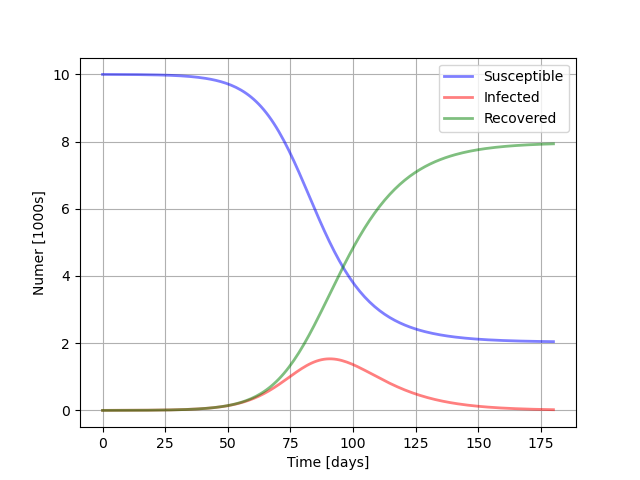

# COVID-19 analysis with compartmental models.

[Compartmental models](https://en.wikipedia.org/wiki/Compartmental_models_in_epidemiology) are mathematical tools to study infectious disease, taking into consideration that the total population is divided into different compartments, according to the condition of each person.

The differences among the methods are the amount of compartments and variables that are studied

## SIR model

This model divide the population into 3 groups:

1. The **susceptible** people who can get the virus.
2. The **infected** people who already have the virus, and start counting with one (pacient zero).
3. The **recovered** group, also called the *removed* one, counts with people cured of the virus also that have died.

The variation on these compartments are described by the following system of differential equations:

Where, β and γ are constants according to the situation, the characterisation of the infectious disease. The solution to those equations in presented hear, as the following graphic.

